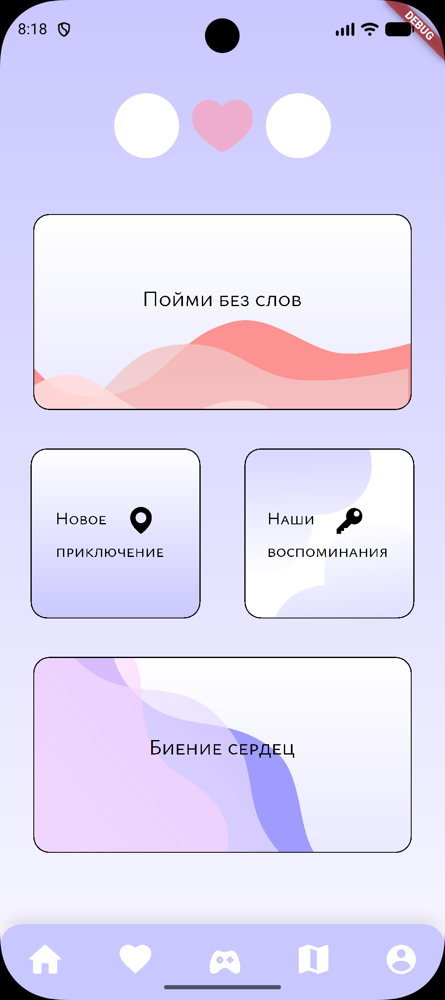
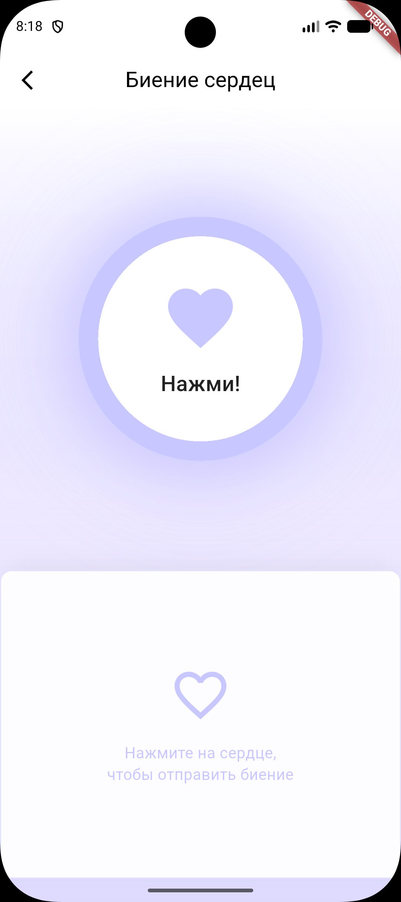
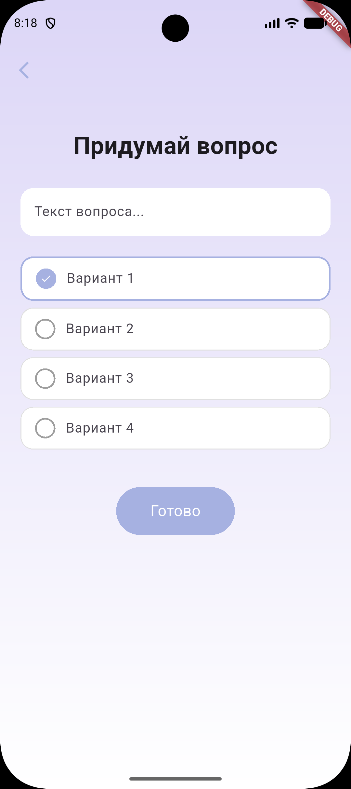

# ❤️ RedString

**Приложение для пар, которые хотят оставаться на связи**

RedString — это мобильное приложение, которое позволяет партнёрам обмениваться «биениями сердца», отслеживать историю взаимодействий и оставаться ближе друг к другу, даже на расстоянии.

---

## Возможности

-  **Отправка биений сердца** — мгновенное уведомление партнёру
-  **История биений** — просмотр всех отправленных и полученных сердец за день
-  **Профиль пользователя** — фото, имя, настройки аккаунта
-  **Подключение пары** — привязка к партнёру по email или коду
-  **Расстояние между партнёрами** — отображение дистанции в реальном времени (в разработке)


---

## Скриншоты

| Главная | Профиль | История |
|:-------:|:-------:|:-------:|
|  |  |  |


## Технологии

| Категория | Технологии |
|-----------|------------|
| **Фреймворк** | Flutter 3.x |
| **Язык** | Dart |
| **Бэкенд** | Firebase (Auth, Firestore) |
| **State Management** | Provider |
| **Локальное хранилище** | Hive / SharedPreferences |
| **Платформы** | Android, iOS |


## Установка и запуск

### 1. Клонирование репозитория

```bash
git clone https://github.com/ВАШ_НИК/redstring.git
cd redstring